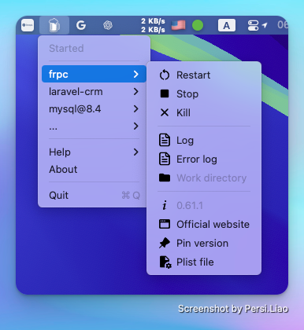

# brew-services-manage

> A macOS Menu Bar application for managing Homebrew services.

English | [简体中文](./README_zh.md)

This reads the [homebrew services](https://github.com/Homebrew/homebrew-services) command, showing you the status of your services and allowing them to be started, stopped and restarted.



### Key Features

- **Service Management**: Easily start, stop, and restart your services with just a click.
- **Log Access**: Quickly open log files and error logs for troubleshooting.
- **Auto-Start Options**: Set services to auto-start at system boot with minimal effort.
- **Pin and Manage Services**: Pin services for easy access and manage the plist files as needed.
- **Seamless Integration**: Automatically detects your Homebrew installation paths for user convenience.

## Install

### Using Homebrew Cask

```shell
brew tap persiliao/tap
brew install --cask brew-services-manage
```

### Manually

Download from the [Releases](https://github.com/persiliao/brew-services-manage/releases) page.

⚠️ You'll see a warning <cite>"**Brew Services Manage**" can't be opened because Apple cannot check it for malicious software</cite>. This is because I haven't paid Apple for a developer account.

[More info about this malicious software warning](https://support.apple.com/en-gb/guide/mac-help/mchleab3a043/mac).

### Autostart

The program doesn't have an option to autostart itself, so you may want to open **System Preferences** -> **General** -> **Login Items** and add the application to the list to have it start when you log in.

## Usage

The operation of the service is carried out by clicking the option of the secondary menu of the specified service

- **Run** Run the service
- **Start** Start the service and set it to auto-start at power-on
- **Restart** restart the service
- **Kill** Kill the service
- **Stop** Stop the service and unset it to auto-start at power-on
- **Log** Open the log file for the service, if one exists
- **Error Log** Open the error log file for the service, if one exists
- **Work directory** Open the service Work directory, if one exists
- **Official website** Open the service homepage
- **Pin** Pin the service
- **UnPin** Un Pin the service
- **Plist** Open the plist file for the service
- **Upgrade** Upgrade service

> If you have installed a new service using another method (e.g. terminal), you need to click **Help** -> **Restart** to reload it

## Homebrew

By default looks for Homebrew at `/usr/local/bin` and `/opt/Homebrew/bin`.

### Sponsor

If this project helpful for you, feel free to [buy me a cup of coffee ☕️](https://www.paypal.com/cgi-bin/webscr?cmd=_s-xclick&hosted_button_id=99S3MWPTJE9Z4)
