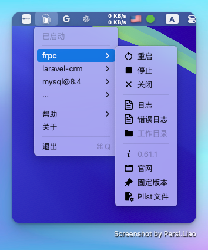

## brew-services-manage
> 一个用于管理 Homebrew 服务的 macOS 菜单栏应用程序。

[English](./README.md) | 简体中文

该应用程序读取 Homebrew 服务命令，显示您服务的状态，并允许您启动、停止和重启服务。



### 主要功能

- **服务管理**: 轻松通过单击来启动、停止和重启服务。
- **日志访问**: 快速打开日志文件和错误日志以进行故障排除。
- **自启动选项**: 设置服务在系统启动时自动启动，操作简单。
- **固定和管理服务**: 可以固定服务以便于访问，并根据需要管理 plist 文件。
- **无缝集成**: 自动检测您的 Homebrew 安装路径，方便用户使用。

### 安装
#### 使用 Homebrew Cask
```bash
brew tap persiliao/tap
brew install --cask brew-services-manage
```
#### 手动安装
从发布页面下载。[Releases](https://github.com/persiliao/brew-services-manage/releases)

⚠️ 您会看到警告 "Brew Services Manage" 无法打开，因为 Apple 无法检查其是否含有恶意软件。这是因为我没有为开发者账户支付费用。

更多关于此恶意软件警告的信息。

### 开机自启动
该程序没有自启动的选项，因此您可能需要打开系统偏好设置 -> 常规 -> 登录项，将应用程序添加到列表中，以便在登录时启动它。

### 使用
服务的操作通过单击指定服务的次级菜单选项进行。

- **运行**: 运行服务
- **启动**: 启动服务，并设置为在开机时自动启动
- **重启**: 重启服务
- **杀死**: 杀死服务
- **停止**: 停止服务，并取消其在开机时自动启动的设置
- **日志**: 打开服务的日志文件（如果存在）
- **错误日志**: 打开服务的错误日志文件（如果存在）
- **工作目录**: 打开服务的工作目录（如果存在）
- **官方网站**: 打开服务的主页
- **固定**: 固定服务
- **取消固定**: 取消对服务的固定
- **Plist**: 打开服务的 plist 文件
- **升级**: 升级服务

如果您使用其他方法（例如终端）安装了新服务，需要单击帮助 -> 重启来重新加载它。

### Homebrew
默认情况下，它会在 `/usr/local/bin` 和 `/opt/Homebrew/bin` 路径下查找 Homebrew。

### 赞赏

如果这个项目对你有帮助，随时给我买一杯咖啡 ☕️


